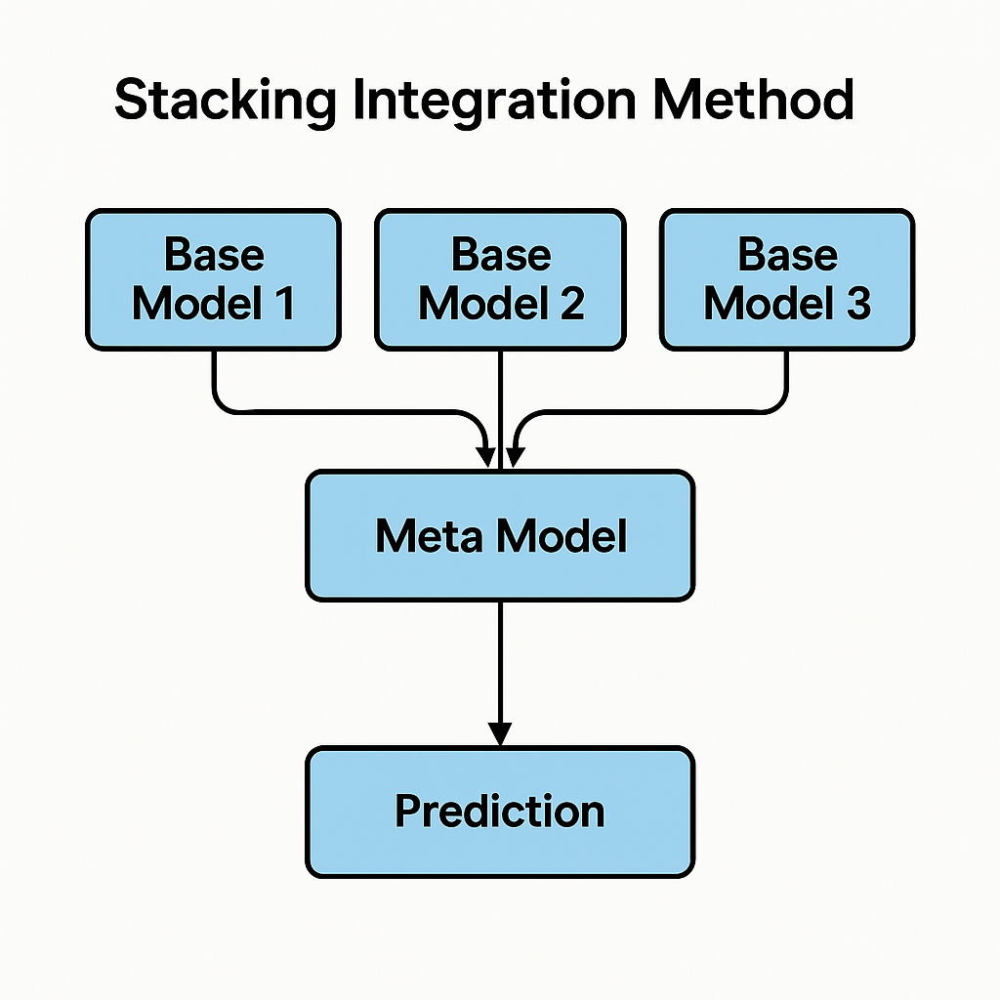

# 报告大纲

## 摘要

## 1 引言

建议添加更多介绍TapTap的内容，体现商业价值，参考链接：

* [关于我们 | TapTap 发现好游戏](https://www.taptap.cn/about-us)
* [TapTap（易玩（上海）网络科技有限公司开发的游戏社区）_百度百科](https://baike.baidu.com/item/Taptap/20623110)
* [TapTap - 维基百科，自由的百科全书](https://zh.wikipedia.org/zh-cn/TapTap)
* [AP202408301639654381.pdf](https://testtoo1.oss-cn-hangzhou.aliyuncs.com/eastmoney_pdf/AP202408301639654381.pdf)
* [关于心动 - 心动](https://www.xd.com/about-us/?lang=zh)

In the mobile gaming ecosystem, TapTap, as a leading global gaming community and distribution platform, hosts user reviews that reflect direct player feedback on game quality and offer critical insights into market demand and user experience. However, game reviews are often characterized by short text length, informal language (e.g., slang like "肝爆" [grinding] or "氪金" [pay-to-win]), and implicit sentiment expressions, posing challenges for traditional sentiment analysis methods (e.g., lexicon-based rule models) that struggle with limited classification accuracy and generalization capabilities.

While prior studies have attempted to improve sentiment analysis using machine learning models (e.g., LR, KNN, SVM) or deep learning models (e.g., LSTM, CNN), there remains a lack of systematic comparison and optimization of pre-trained language models and ensemble strategies in the context of game reviews. Furthermore, most existing research relies on small-scale datasets (The largest known dataset currently includes fewer than 5,000 reviews.) and fails to address the unique linguistic characteristics of Chinese game reviews.

To address these challenges, this study proposes the following solutions:

- **Dataset Construction:** A large-scale Chinese game review dataset (40 games × 1,000 reviews, totally 40,000 reviews) is curated, covering diverse game genres and user expression patterns.
- **Model Comparison:** Four categories of models are rigorously evaluated, including lexicon-based methods, machine learning models, deep learning architectures, and pre-trained language models.
- **Ensemble Optimization:** A cross-validation-driven ensemble voting mechanism is designed to combine top-performing models, overcoming the limitations of single-model approaches.

The key innovations of this work include:

- **Data Contribution:** The first large-scale, fine-grained annotated Chinese sentiment analysis dataset tailored for TapTap game reviews.
- **Methodological Advancements:** Integration of cutting-edge pre-trained models  and lightweight models to balance accuracy and computational efficiency.
- **Strategic Breakthrough:** A dynamic weighted voting mechanism that achieves a great accuracy improvement over the best single model.

This research not only provides an efficient sentiment analysis tool for game developers and operators but also offers empirical insights into the application of multi-model ensemble optimization in natural language processing tasks.

## 2 数据采集与预处理 Data Collection and Preprocessing

### 2.1 数据采集 Data Collectioon

The user review data utilized in this study was systematically collected from the official TapTap gaming platform. Employing a multi-criteria selection framework that integrated platform ranking positions, review volume metrics, and game popularity indices, we identified 40 representative game titles. For each selected game, custom web crawlers were developed to extract the most recent 1,000 user reviews, capturing seven key data dimensions: unique user identifier, username, numerical rating score, textual review content, like counts, review publication timestamp, and device model information. Through systematic data aggregation and validation processes, this methodology yielded a comprehensive raw dataset comprising 40,000 distinct user reviews, establishing a robust foundation for subsequent analytical investigations.

The 40 games selected are listed below (arranged by the first letter of the English name):

| 序号 |            英文名            |           中文名           | 序号 |           英文名           |      中文名      |
| :--: | :---------------------------: | :------------------------: | :--: | :-------------------------: | :--------------: |
|  01  |       7 Years From Now       |      我在7年后等着你      |  21  |           Justice           |      逆水寒      |
|  02  |         Aether Gazer         |          深空之眼          |  22  |       Light and Night       |    光与夜之恋    |
|  03  |           Arknights           |          明日方舟          |  23  |     Love and Deepspace     |     恋与深空     |
|  04  |           Azur Lane           |          碧蓝航线          |  24  |  Minecraft: Pocket Edition  | 我的世界：移动版 |
|  05  | BanG Dream! Girls Band Party! | BanG Dream! 少女乐团派对！ |  25  |          Muse Dash          |     喵斯快跑     |
|  06  |         Blue Archive         |          蔚蓝档案          |  26  |     Naraka: Bladepoint     |     永劫无间     |
|  07  |           Cytus II           |      音乐世界赛特斯2      |  27  |           Naruto           |     火影忍者     |
|  08  |          Dead Cells          |          死亡细胞          |  28  |           Onmyoji           |      阴阳师      |
|  09  |          Delta Force          |         三角洲行动         |  29  |           Phigros           |     菲格罗斯     |
|  10  |          Eggy Party          |          蛋仔派对          |  30  |        Reverse:1999        |  重返未来：1999  |
|  11  |       Fate/Grand Order       |       命运-冠位指定       |  31  |         Sausage Man         |     香肠派对     |
|  12  |        Game for Peace        |          和平精英          |  32  | Sky: Children of the Light |      光·遇      |
|  13  |        Genshin Impact        |            原神            |  33  | Snowbreak: Containment Zone |     尘白禁区     |
|  14  |     GRAY RAVEN：PUNISHING     |         战双帕弥什         |  34  |         Soul Knight         |     元气骑士     |
|  15  |        Honkai Impact 3        |           崩坏3           |  35  |      Teamfight Tactics      |    金铲铲之战    |
|  16  |       Honkai: Star Rail       |       崩坏：星穹铁道       |  36  |       Tears of Themis       |    未定事件簿    |
|  17  |        Honor of Kings        |          王者荣耀          |  37  |          Terraria          |     泰拉瑞亚     |
|  18  |             ICEY             |            艾希            |  38  |      WHERE WINDS MEET      |    燕云十六声    |
|  19  |          Identity Ⅴ          |          第五人格          |  39  |       Wuthering Waves       |       鸣潮       |
|  20  |        Infinity Nikki        |          无限暖暖          |  40  |      Zenless Zone Zero      |      绝区零      |

### 2.2 数据清洗 Data Cleaning

- 这部分清洗出了两个CSV文件，taptap\data\integrated\cleaned_taptap_reviews.csv是一般方法用的，taptap\data\integrated\lm_cleaned_taptap_reviews.csv是专门给预训练语言模型用的；
- 它们的主要区别在于前者对评论内容进行了分词处理，并去除了emoji表情；
- 具体的清洗步骤参见：taptap\analytics\data_cleaning\data_cleaning.py

### 2.3 最终数据集 Final Dataset

## 3 方法论与模型设计

***介绍下面各个模型的时候最好能放上结构图。***

### 3.1 基于情感词典的模型——基线模型

采用了基于SnowNLP词典的分类方法，效果不佳（0.69），很适合作为基线模型，体现后续其他模型的大幅度提升。

关于SnowNLP：[SnowNLP: Simplified Chinese Text Processing](https://github.com/isnowfy/snownlp)

### 3.2 传统机器学习模型

#### 3.2.1 逻辑回归

#### 3.2.2 KNN

#### 3.2.3 决策树

#### 3.2.4 支持向量机 SVM

#### 3.2.5 Boosting集成学习

### 3.3 传统深度学习模型

#### 3.3.1 卷积神经网络 CNN

#### 3.3.2 双向长短时记忆网络 BiLSTM

### 3.4 预训练语言模型

### 3.5 堆叠泛化 **Stacked Generalization**

~~特别感谢：Gemini-2.5-pro、RTX 4070 SUPER~~

基模型：XGBoost、CatBoost和bert-base-chinese预训练语言模型；

元模型：Logistic Regression；

完整的notebook文件代码蔚为壮观，参见：taptap\analytics\ensemble_voting\enhanced_ensemble_voting.ipynb。

Stacking集成方法架构图如下：

**Stacking (Stacked Generalization)**

**Stacking（堆叠泛化）**

**English:**
Stacking, short for Stacked Generalization, is an advanced ensemble machine learning technique. It combines multiple different types of machine learning models (called base models or level-0 models) by training a final model (called a meta-learner or level-1 model) to make predictions based on the outputs of the base models.

**中文:**
Stacking，全称是 Stacked Generalization（堆叠泛化），是一种高级的集成机器学习技术。它通过训练一个最终模型（称为元学习器 meta-learner 或 L1 层模型 level-1 model）来组合多个不同类型的机器学习模型（称为基模型 base models 或 L0 层模型 level-0 models）的预测结果，这个元学习器基于基模型的输出来进行预测。

**How it Works (Simplified):**

**工作原理（简化版）：**

**English:**

1. **Train Base Models (Level-0):** The original training data is used to train several diverse base models (e.g., SVM, RandomForest, KNN, GradientBoosting).
2. **Generate Predictions for Meta-Learner Training:** To avoid data leakage and overfitting, the predictions from the base models that will be used to train the meta-learner are typically generated using a cross-validation strategy. For each fold in the cross-validation, the base models are trained on the other folds and make predictions on the current fold. These "out-of-fold" predictions form the input features for the meta-learner.
3. **Train Meta-Learner (Level-1):** A meta-learner (often a relatively simple model like Logistic Regression, Ridge Regression, or even another complex model) is trained using the predictions from the base models (generated in step 2) as input features, and the original target variable as the output label.
4. **Final Prediction:** When making a prediction on new, unseen data, the input is first passed through all the trained base models. Their predictions are then fed into the trained meta-learner, which produces the final output prediction.

**中文:**

1. **训练基模型（L0 层）：** 使用原始训练数据训练多个不同的基模型（例如：支持向量机 SVM、随机森林 RandomForest、K近邻 KNN、梯度提升 GradientBoosting）。
2. **为元学习器生成训练预测：** 为了避免数据泄露和过拟合，用于训练元学习器的基模型预测通常是通过交叉验证策略生成的。对于交叉验证中的每一折，基模型在其他折上进行训练，并在当前折上进行预测。这些“折外”（out-of-fold）预测构成了元学习器的输入特征。
3. **训练元学习器（L1 层）：** 使用基模型在步骤 2 中生成的预测作为输入特征，原始目标变量作为输出标签，来训练一个元学习器（通常是相对简单的模型，如逻辑回归、岭回归，或者也可以是另一个复杂模型）。
4. **最终预测：** 当对新的、未见过的数据进行预测时，输入数据首先通过所有已训练好的基模型。这些基模型的预测结果随后被输入到已训练好的元学习器中，由元学习器产生最终的输出预测。

**Goal:**

**目标：**

**English:**
The primary goal of Stacking is to leverage the strengths of multiple different models and combine them intelligently using the meta-learner, often resulting in better predictive performance than any single base model could achieve on its own.

**中文:**
Stacking 的主要目标是利用多个不同模型的优势，并通过元学习器智能地将它们结合起来，从而通常能获得比任何单个基模型独立运行时更好的预测性能。

**Key Considerations:**

**关键考虑因素：**

**English:**

* **Diversity of Base Models:** Stacking works best when the base models are diverse and make different kinds of errors.
* **Complexity:** It is generally more complex to implement and computationally more expensive than simpler ensemble methods like Bagging or Boosting.
* **Overfitting:** Careful implementation (especially regarding the generation of meta-learner training data using cross-validation) is needed to avoid overfitting.

**中文:**

* **基模型的多样性：** 当基模型具有多样性并且会犯不同类型的错误时，Stacking 的效果最好。
* **复杂性：** 与 Bagging 或 Boosting 等更简单的集成方法相比，Stacking 通常实现起来更复杂，计算成本也更高。
* **过拟合：** 需要谨慎实施（尤其是在使用交叉验证生成元学习器训练数据方面）以避免过拟合。

## 4 结果与分析

## 5 总结与展望

## 参考文献
